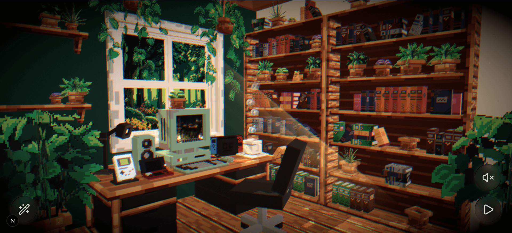

# ⭐ Welcome to my portfolio! ⭐


## Setup

Download and install Node.js then run this followed commands:

```bash
# Install dependencies
npm install

# Serve at localhost:3000
npm run dev

# Build for production in the dist/ directory
npm run build
```

## License

This project is licensed under the MIT License.
